# CMP301B: Computer Architecture

# Introduction

A program performance is affected by:

- Algorithm
- Programming Language, Compiler, Architecture...
- Processor and Memory 
- I/O system

## Eight great ideas in Computer Architecture

1. Design for Moore's law
    - We need to anticipiate where the technology will be when the design finishes, instead of where it starts.
2. Use Abstraction to simplify design
    - Use abstraction to hide low level details to simplify models at a higher level
3. Make the common case fast
    - Making common case faster will better enhance the performance
4. Performance via Parallelism
    - Use parallelism to enhance your performance
5. Performance via Pipelining
    - Use pipelining (parallelism on the level of instructions) to enhance performance
6. Performance via Prediction
    - It is better to predict and be right sometimes than to do nothing at all
7. Hierarchy of memories
    - Use different level of memories with different speeds
8. Dependability via Redundancy
    - Add redundant components to make system realiable

# Performance

When measuring CPUs' performance, we are concerned with:
- Reponse time
  - How long does it take for the job to run?
- Throughput
  - How many jobs can the machine run at the same time?

## Execution Time

- $ET$: Execution time
- $IC$: Instruction count for a program
- $CPI$: Cycles per instruction
- $CR$: Cycles per second
- $CT$: Cycle time

---

- $\text{Perf}_X = \dfrac{1}{\text{ET}_X}$
- $\dfrac{\text{Perf}_X}{\text{Perf}_Y} = n$, X is n times faster than Y
- $ET = \dfrac{IC * CPI}{CR}$
- $CR = \dfrac{1}{CT}$
- $\text{\# Cycles} = CPI * IC$
- $CT = \dfrac{ET}{\text{\# Cycles}}$
- $\text{Speed up} = \dfrac{\text{Perf}_{new}}{\text{Perf}_{old}} = \dfrac{\text{ET}_{old}}{\text{ET}_{new}}$ 
- $\text{Percentage of Speed Improved} = (\dfrac{Perf_{new}}{Perf_{old}} - 1) * 100 = (\dfrac{ET_{old} - ET_{new}}{ET_{new}}) * 100$
- $\text{Percentage of improvement / Reduction of ET} = (1 - \dfrac{ET_{new}}{ET_{old}}) * 100$
- $\text{Total time after improvement (Amadahl's Law)} = \text{unaffected time} + \dfrac{\text{time that could be improved}}{\text{amount of partial speedup}}$

**Note**: changing the cycle time often changes the
number of cycles required for various instructions
## Components Analysis
Which component affects what?

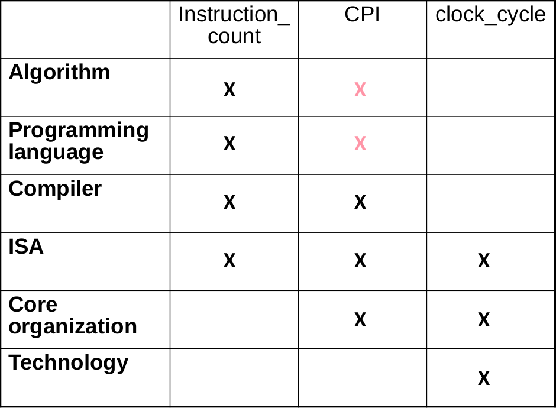

## Pitfalls

1. Using a subset of the performance equation as a performance measure
2. Expecting the improvement of overall performance by the same ratio of improvement of one aspect

# MIPS Instruction Types

The MIPS architecture has 3 types of instructions:

## 1. ALU Instructions (R-type)

Logical and Arithmetic operations such as: ADD, SUB, AND, shift
### IR format

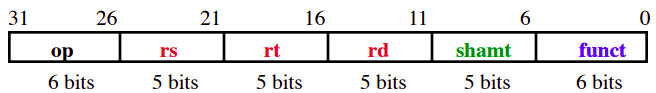

**op**: opcode for instruction
**rs**: address of source1 register
**rt**: address of source2 register
**rd**: address of destination register
**shmat**: shift amount
**funct**: type of ALU operation

## 2. Immediate Format Instructions (I-type)

Instructions with immediates, such as 
- **lw** and **sw** (offset counts as immediate) `lw Rt, N(Rs)`, `sw Rt, N(Rs)`
- branches like **beq** and **bne** `beq Rs, Rt, Label`

### IR format

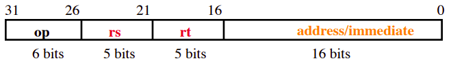

## 3. Jump Format Instructions (J-type)

- Conditional and Unconditional branches
- They cause an immediate value to be added to PC

### IR format

# MIPS Stages of Execution

The MIPS ISA breaks down the execution of all types of instructions into 5 stages:
1. Instruction Fetch	
2. Instrucion Decode	
3. ALU / Instruction Execute
4. Memory	Access	
5. Register	Write (Write-Back)	

Each stage is executed in a whole cycle.

## 1. Instruction Fetch (IF)

Fetching the instruction involves:
- Reading the instruction from instruction memory
- Updating the PC to hold address of next instruction

**Note**: Updating the PC and fetching the instruction occurs every instruction so it does not need special control signals.

## 2. Instruction Decode (ID)

Decoding the instruction involves:
- Sending opcode of fetched instruction into control unit
- Reading values from register file

## 3. Instruction Execute (IE)

- This is the core of the instruction execution, it executes the instruction logic itself.
- Only for R-type and I-type instructions

For each instruction type we have a different flow:

- R-type:
  - Perform the ALU operation on the source registers
- I-type:
  - For **lw** and **sw**: calculate the offset of the memory address
  - For **branch**: compute branch condition (if exists) and compute branch offset

## 4. Memory Access (MEM)

- Only for **lw** and **sw**
- Access the memory to fetch or store values.
- For **lw**, the actual value fetched from memory is moved to the register on the next cycle.
## 5. Write-Back (WB)

- Only for **Register-Register ALU** instructions or **lw** instruction
- Writes the data into the destination register

# MIPS Single Cycle Datapath

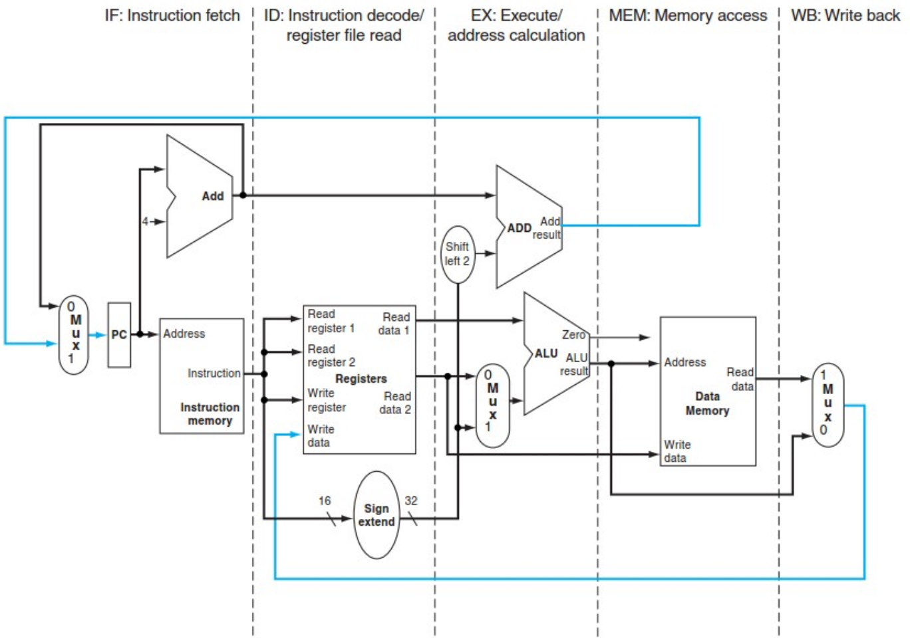

The separate stages and components are controlled by a **Control Unit** that is responsible for setting the control signals based on the instruction

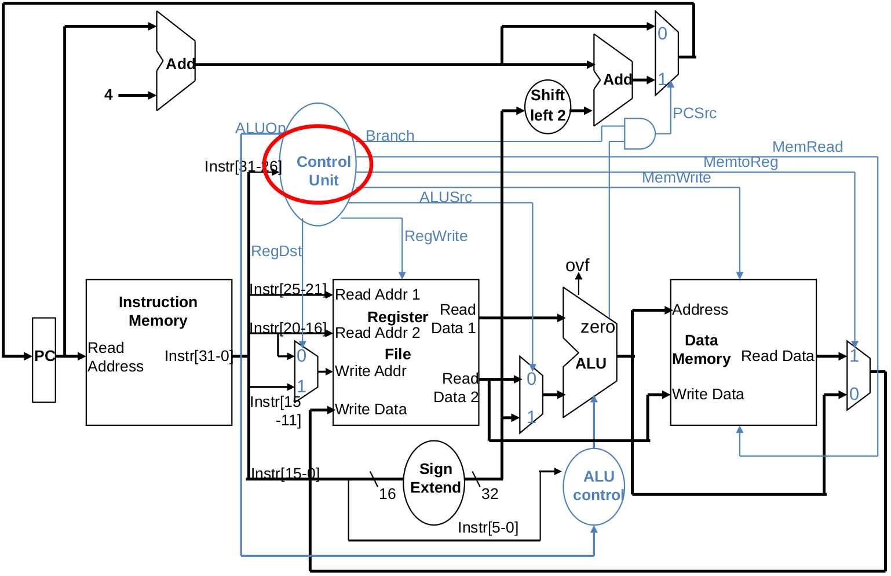

**Note**: You are encouraged to refer to the lecture here and trace each instruction type execution flow on the single cycle datapath.

## Executing multiple instructions

When executing a single instruction at a time:

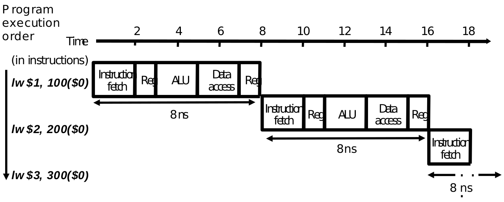

# Pipelining

- Pipelining is overlapping processor subtasks to enhance performance
- It does not increase latency of single task, but it increases throughput of entire processor
  - i.e. it reduces average instruction time, therefore reducing average CPI

## Benchmarking pipelining

- For the first instruction in a pipelining flow, we take $t \cdot k$ time, where $t$ is the time of the longest stage, $k$ is number of stages
  - However for next instructions we only need $t$ time for each.

- For **n** iterations of tasks, the execution times of $k$-stage pipeline:
  - With no pipelining: $nk$ time units
  - With pipelining: $k + (n-1)$ time units
  - Speedup: $\dfrac{nk}{k+(n-1)} = k$ for large $n$

## Executing multiple instructions

- We can overlap stages and execute multiple stages at the same time, resulting in a huge performance boost
- Note that the execution time of any stage is the time of the longest stage

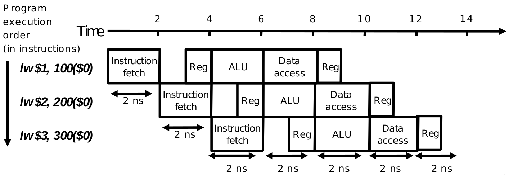

## The pipelined datapath

- Need to add registers between stages to avoid data corruption

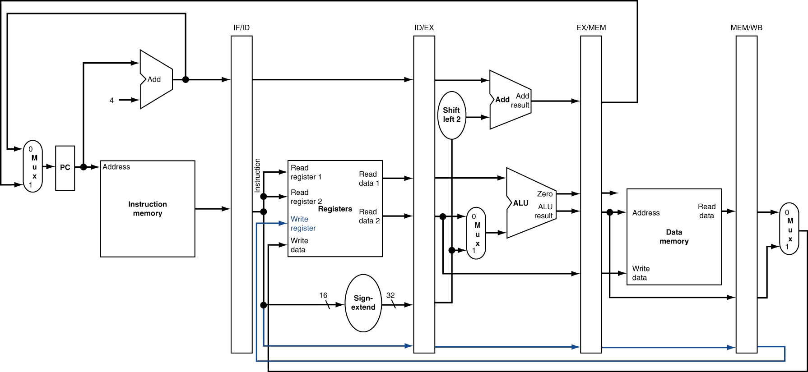

The **Control Unit** needs to deal with the registers between stages instead of the units themselves.

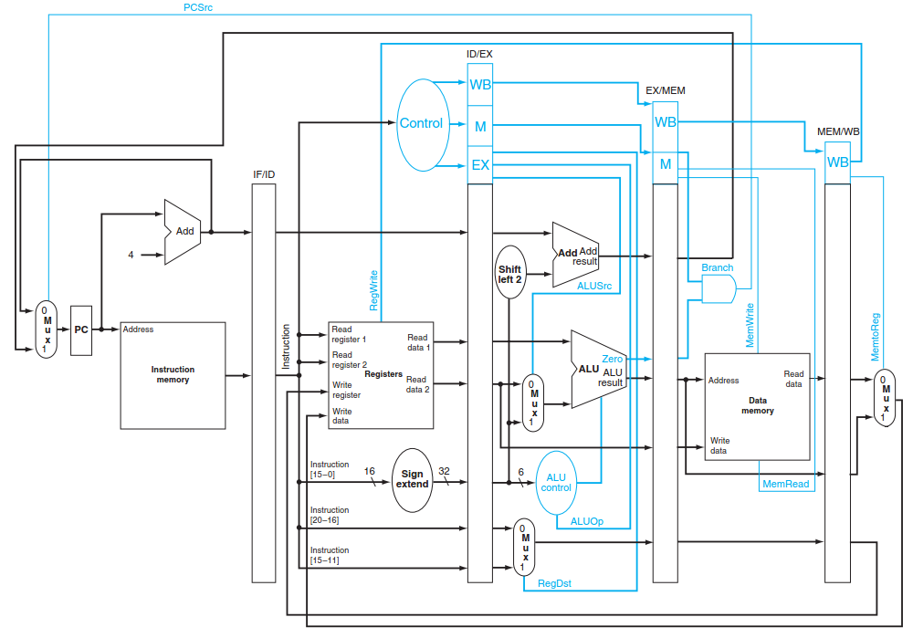

# Pipelining Hazards

- Situations that prevent an instruction from being executed in its designated clock cycle

- The simplest solution for hazards is to stall the pipeline (not efficient)
  - We can solve some situation of the hazards without affecting performance as much.

## Structural Hazards

- Happens when multiple stages want to use the same hardware at the same time.
- Conflict for use of a resource.
- Usually solved by throwing more hardware at the problem.

Occurs in two scenarios:

1. Load/Store instruction trying to read/write memory while another instruction is being fetched
    - 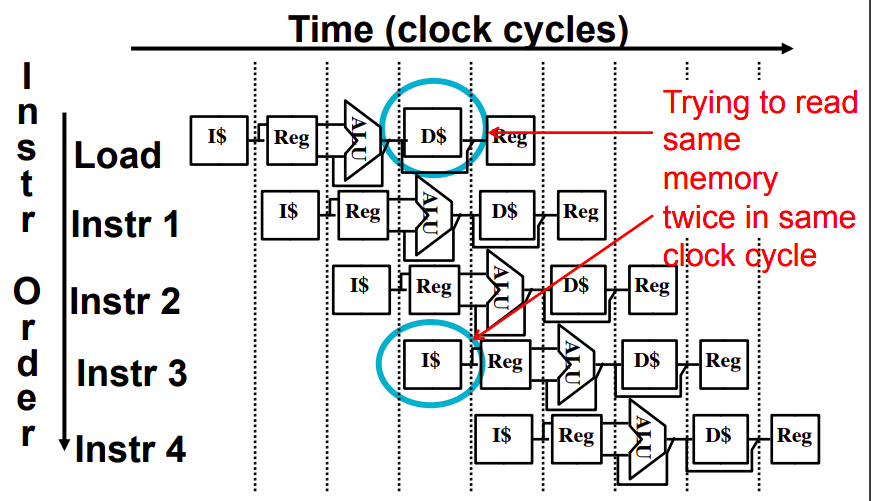
    - **Solution**: can separate instruction memory and data memory into separate hardwares.
2. One instruction trying to write into a register while another is reading from it in the same clock cycle
    - 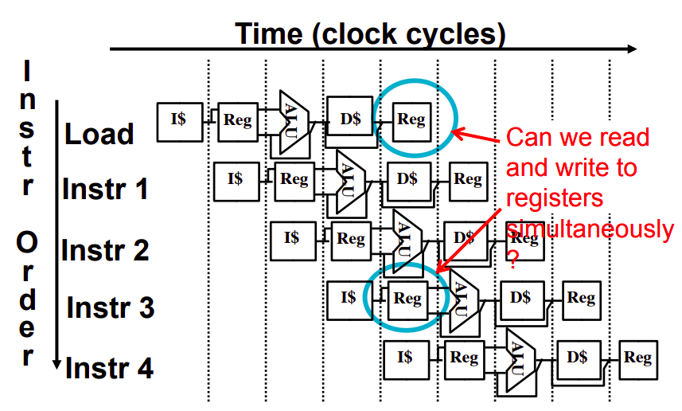
    - **Solution**:
      - Write during first 1/2 of the clock cycle, Read during second 1/2 of the clock cycle
      - Build RegFile with independent read/write ports

**Note:** We can also stall the pipeline to solve structural hazards, however is this is unnecessary.

## Data Hazards

- Occurs due to dependency of data between two instructions

**Instructions with red back arrows cannot be executed in time**

Solutions:

1. Reorder code structure (software solution):
    - Change the order of the instructions to remove dependencies (need to have independent instruction somewhere)
    - If we cannot find any independent instructions:
      - Insert NOP to delay pipeline (adding software bubble)

2. Stalling the pipeline with hardware
   - Need special hardware to check for dependency
  
3. Forwarding: 
   - Forward data as soon as it is available, don't wait for the whole pipeline to finish
   - We can use the output of the ALU and inject it in parallel instructions instead of waiting for write-back
   - 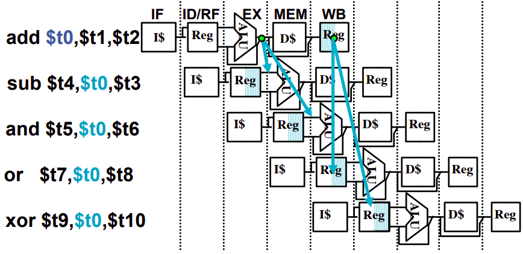
   - This can be acheived by adding special hardware to forward data backwards
   - 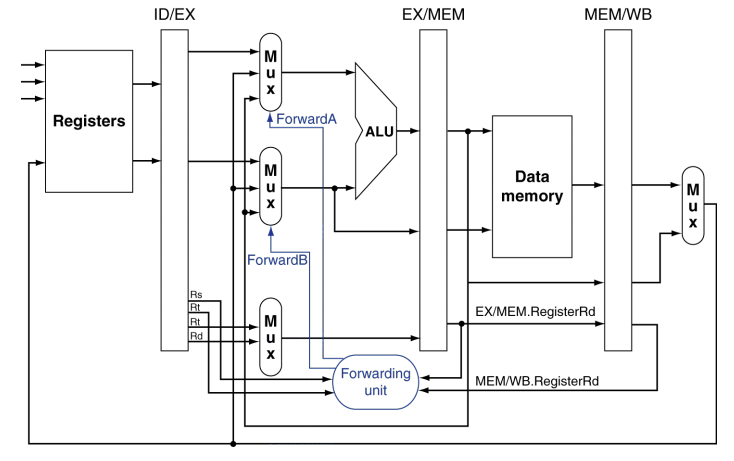
   - In some cases, forwarding does not completely solve the problem of data hazards
   - e.g. 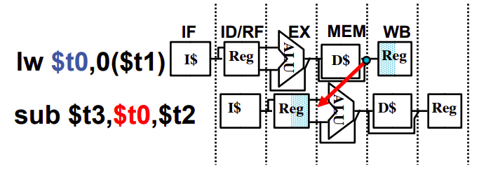
   - We can do forwarding if we stall the next instruction after the `lw`
   - 

**Note:** We can change the ordering of instructions to fix the `lw` forwarding problem

